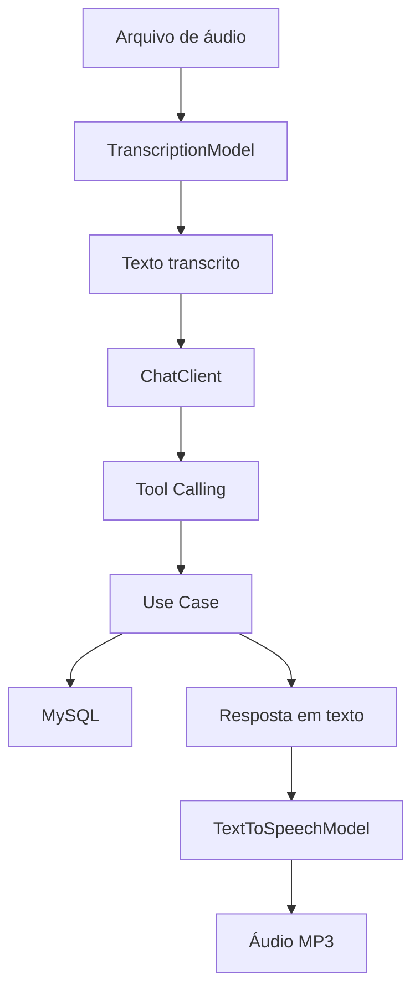

# FinVoice — Assistente Financeiro Inteligente

Projeto desenvolvido no desafio de Spring AI da DIO. A aplicação registra e consulta transações financeiras por endpoints REST ou comandos de voz. O áudio enviado pelo usuário é transcrito, interpretado pelo modelo e pode acionar casos de uso reais por Tool Calling. A resposta final é convertida para MP3.

O projeto base foi mantido com a arquitetura em camadas da trilha. Como evolução, foi criado um resumo financeiro com total geral e totais por categoria, além de validações para transações e arquivos de áudio.

## Funcionalidades

- Cadastro de transações por REST;
- Consulta de transações por categoria;
- Resumo financeiro com total geral e agrupamento por categoria;
- Registro e consulta por comando de voz;
- Transcrição de áudio em português brasileiro;
- Tool Calling para executar casos de uso Java;
- Resposta do assistente em áudio MP3;
- Persistência das transações no MySQL;
- Validação de valores, descrição, categoria e arquivo de áudio;
- Respostas de erro padronizadas;
- Testes unitários sem consumo da API da OpenAI;
- Testes de integração separados e condicionados à presença de credencial.

## Fluxo do assistente



O modelo interpreta a solicitação, mas não acessa o banco diretamente. As ferramentas chamam os mesmos casos de uso utilizados pelos endpoints REST.

## Arquitetura

```text
dio.budgeting
├── domain
│   ├── Category
│   ├── Transaction
│   ├── TransactionId
│   └── TransactionRepository
├── application
│   ├── PersistTransactionUseCase
│   ├── ListTransactionsByCategoryUseCase
│   ├── GetTransactionSummaryUseCase
│   ├── input
│   └── output
└── infrastructure
    ├── http
    │   ├── request
    │   └── response
    └── persistence
        ├── entity
        └── repository
```

- `domain`: modelo financeiro, validações e contrato de persistência;
- `application`: casos de uso acessados pelo REST e pelas ferramentas da IA;
- `infrastructure`: controllers, tratamento HTTP, JPA, MySQL e integração com Spring AI.

## Tecnologias

| Tecnologia | Uso no projeto |
|---|---|
| Java 25 | Linguagem principal |
| Spring Boot 4.0.5 | Configuração e execução da aplicação |
| Spring Web | Endpoints REST e upload multipart |
| Spring Data JPA | Persistência das transações |
| Spring AI 2.0.0-M4 | Chat, Tool Calling, transcrição e voz |
| OpenAI | Modelos de chat, Speech-to-Text e Text-to-Speech |
| MySQL 9.6 | Banco de desenvolvimento |
| Docker Compose | Execução local do MySQL |
| Gradle Wrapper | Build do projeto |
| H2 | Banco em memória durante os testes |
| JUnit e AssertJ | Testes automatizados |

## Modelos configurados

| Recurso | Modelo |
|---|---|
| Chat | `gpt-4o-mini` |
| Transcrição | `whisper-1` |
| Síntese de voz | `gpt-4o-mini-tts` |
| Voz | `nova` |
| Formato da resposta | `mp3` |

## Pré-requisitos

- JDK 25;
- Git;
- Docker com Docker Compose;
- Uma chave da API da OpenAI para testar o fluxo de IA.

Não é necessário instalar o Gradle globalmente, pois o projeto possui o Gradle Wrapper.

## Configuração

Entre na pasta do projeto:

```bash
cd dio-spring-boot-learning-track/05-spring-ai
```

Configure a chave somente como variável de ambiente:

```bash
export OPENAI_API_KEY="sua_chave_aqui"
```

Nunca coloque uma chave real no `application.properties`, em arquivos versionados ou nos exemplos de requisição.

## Banco de dados

O `compose.yml` cria um MySQL para desenvolvimento com estas configurações:

| Item | Valor |
|---|---|
| Banco | `transaction` |
| Usuário | `app` |
| Porta local | `3307` |
| Porta do container | `3306` |

Suba o banco:

```bash
docker compose up -d
docker compose ps
```

Para acompanhar os logs:

```bash
docker compose logs -f database
```

## Executando a aplicação

No Linux ou macOS:

```bash
./gradlew bootRun
```

No Windows:

```powershell
./gradlew.bat bootRun
```

A API ficará disponível em `http://localhost:8080`.

## Endpoints

| Método | Endpoint | Descrição |
|---|---|---|
| `POST` | `/transactions` | Cadastra uma transação por JSON |
| `GET` | `/transactions/{category}` | Lista transações de uma categoria |
| `GET` | `/transactions/summary` | Retorna o resumo financeiro |
| `POST` | `/transactions/ai` | Processa um comando enviado em áudio |

As categorias atuais são `GROCERIES`, `PHARMA` e `AUTO`.

### Criar uma transação

Os valores recebidos pela API são representados em centavos. Por exemplo, `4590` corresponde a R$ 45,90.

```bash
curl -X POST http://localhost:8080/transactions \
  -H "Content-Type: application/json" \
  -d '{
    "description": "Remédio",
    "category": "PHARMA",
    "amount": 4590
  }'
```

Exemplo de resposta:

```json
{
  "id": "ad1e68cc-691c-46ad-9e0b-2f2db1cd9021",
  "category": "PHARMA",
  "description": "Remédio",
  "amount": 45.9
}
```

### Consultar por categoria

```bash
curl http://localhost:8080/transactions/GROCERIES
```

### Consultar o resumo financeiro

```bash
curl http://localhost:8080/transactions/summary
```

Exemplo de resposta:

```json
{
  "transactionCount": 4,
  "total": 123.5,
  "categories": [
    {
      "category": "GROCERIES",
      "total": 75.0
    },
    {
      "category": "PHARMA",
      "total": 18.0
    },
    {
      "category": "AUTO",
      "total": 30.5
    }
  ]
}
```

### Enviar um comando de voz

```bash
curl -X POST http://localhost:8080/transactions/ai \
  -F "file=@comando.m4a" \
  --output resposta.mp3
```

Exemplos de comandos:

- “Gastei 35 reais na farmácia.”
- “Mostre meus gastos com mercado.”
- “Quanto eu gastei até agora?”

São aceitos arquivos `mp3`, `mp4`, `mpeg`, `mpga`, `m4a`, `wav` e `webm`, com limite de 25 MB.

A resposta em voz é gerada por inteligência artificial. O endpoint também envia o cabeçalho `X-AI-Generated-Voice: true` para identificar essa origem.

## Validações

Uma transação somente é salva quando:

- A descrição foi informada e possui no máximo 255 caracteres;
- O valor em centavos é maior que zero;
- A categoria é válida.

O endpoint de áudio rejeita arquivos vazios, formatos não suportados e arquivos maiores que 25 MB.

Exemplo de erro:

```json
{
  "status": 400,
  "message": "O valor da transação deve ser maior que zero"
}
```

## Testes

Execute os testes de domínio, casos de uso, validações HTTP e contexto Spring:

```bash
./gradlew test
```

Esses testes utilizam H2 e não fazem chamadas para a OpenAI.

Os testes que usam chat, transcrição e síntese de voz ficam separados:

```bash
export OPENAI_API_KEY="sua_chave_aqui"
./gradlew integrationTest
```

As classes de integração possuem uma condição que impede a execução quando `OPENAI_API_KEY` não está configurada.

## Melhoria implementada

A evolução escolhida foi o resumo financeiro. Para isso foram adicionados:

- Um novo método no contrato `TransactionRepository` para recuperar as transações;
- Implementação do método no adaptador JPA;
- `GetTransactionSummaryUseCase`;
- Saídas específicas para o total geral e os totais por categoria;
- Tool `get-transaction-summary` registrada no `ChatClient`;
- Endpoint `GET /transactions/summary`;
- Testes para resumo preenchido e vazio.

Também foi corrigida a conversão da unidade monetária. O domínio armazena valores em centavos, e as respostas REST agora convertem corretamente `4590` para `45.90`.

## Segurança

- A chave da OpenAI é lida pela variável `OPENAI_API_KEY`;
- Arquivos `.env` são ignorados pelo Git;
- Nenhuma credencial real deve ser enviada ao GitHub;
- As credenciais do `compose.yml` são apenas para desenvolvimento local.

## Aprendizados

Durante o desafio foram praticados:

- Configuração do Spring AI com Spring Boot;
- Diferença entre transcrição de áudio e interpretação de intenção;
- Uso do `ChatClient` e de métodos `@Tool`;
- Reutilização dos casos de uso entre REST e IA;
- Separação entre domínio, aplicação e infraestrutura;
- Persistência com JPA e MySQL;
- Testes sem dependência de serviços externos;
- Validação de dados antes da persistência.

## Referências

- [Repositório da trilha Spring Boot da DIO](https://github.com/digitalinnovationone/dio-spring-boot-learning-track)
- [Documentação do Spring AI](https://docs.spring.io/spring-ai/reference/index.html)
- [Documentação de transcrição da OpenAI](https://developers.openai.com/api/docs/guides/speech-to-text)
- [Documentação de Text-to-Speech da OpenAI](https://developers.openai.com/api/docs/guides/text-to-speech)
